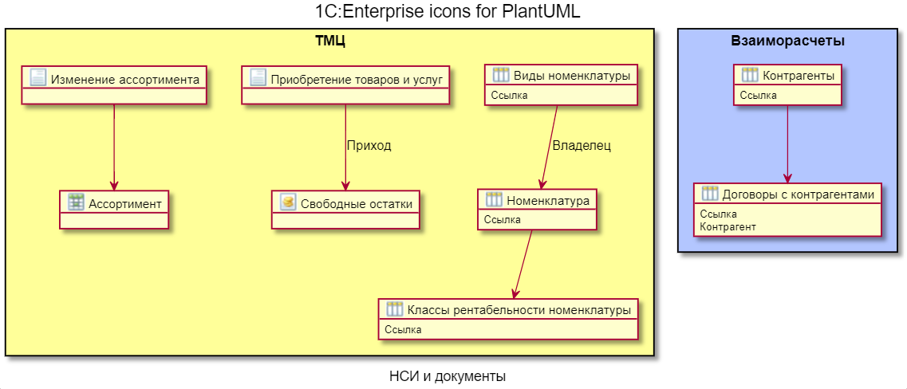

# 1ce-icons-for-plantuml

Набор спрайтов и макросов по объектам платформы 1С:Предприятие для использования в диаграммах PlantUML.



## Начало работы

Обратите внимание, что работать с этой библиотекой можно либо локально, либо через интернет.

### Локально

Работа локально позволяет не зависеть от интернета и вносить изменения в библиотеку самостоятельно.

- клонировать репозиторий
- в начале _вашего_ puml-файла добавить директивы импорта

```puml
!include <Путь>/dist/common.puml
!include <Путь>/dist/v8_Catalog.puml
и т.д.
```

> При работе локально вместо подключения нескольких отдельных файлов с префиксом `v8_` можно подключить единственный файл `all.puml`

### Через интернет

- в начале _вашего_ puml-файла добавить директивы импорта (обращайте внимание на версию):

```puml
!define v8_PUML https://raw.githubusercontent.com/ovcharenko-di/1ce-icons-for-plantuml/0.2.0/dist
!include v8_PUML/common.puml
!include v8_PUML/v8_Catalog.puml
и т.д.
```

> ВНИМАНИЕ! При работе через интернет необходимо подключать каждый файл отдельно.

## Доработка

Принимаются идеи и пожелания по развитию!

Добавить поддержку нового объекта метаданных самостоятельно нетрудно. Для этого необходимо:

- в каталоге dist создать файл для нового объекта метаданных путем копирования имеющегося
- в новом файле:
  - заменить спрайт. О том, как как из png создать спрайт, см. [документацию](https://plantuml.com/en/sprite)). Спрайты могут быть разного размера, но 16x16 вполне хватает.
  - переопределить названия макросов (при изменении сигнатуры нужно обязательно учесть это в файле `common.puml` и проверить все остальные макросы)
- указать путь к новому файлу в файле `all.puml`
- направить Pull Request

## Благодарности

- @EvilBeaver за доклад на IS 2021, который натолкнул меня на идею создания этой библиотеки
- авторам библиотек [plantuml-stdlib](https://github.com/plantuml/plantuml-stdlib) и [AWS-PlantUML](https://github.com/milo-minderbinder/AWS-PlantUML), которые были взяты за образец.
